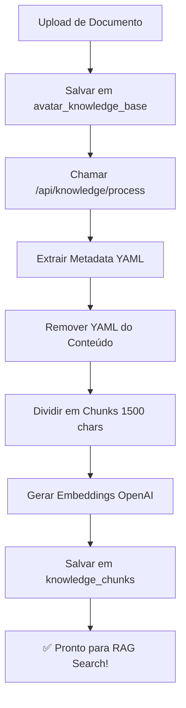

# 🤖 Sistema Automático de Processamento de Chunks

Sistema completo para processar documentos e criar chunks automaticamente, sem intervenção manual.

---

## 🎯 O Que Foi Criado

### 1. **API Endpoint** - `/api/knowledge/process`
- `POST`: Processa um documento novo
- `PUT`: Reprocessa um documento existente (deleta chunks antigos)

### 2. **API Endpoint** - `/api/knowledge/pending`
- `GET`: Lista documentos sem chunks (pendentes de processamento)

### 3. **Hook React** - `use-document-processing.ts`
- `processDocumentAfterUpload()`: Chama API após upload
- `reprocessDocument()`: Reprocessa documento existente

### 4. **Script CLI** - `auto-process-all.ts`
- Processa TODOS os documentos pendentes de uma vez

---

## 🚀 Como Usar

### **Opção 1: Processamento Automático no Upload**

```typescript
// No seu componente de upload
import { processDocumentAfterUpload } from '@/lib/hooks/use-document-processing'

async function handleUpload(file: File) {
  // 1. Upload do arquivo
  const uploadRes = await fetch('/api/knowledge/upload', {
    method: 'POST',
    body: formData,
  })
  
  const { documentId } = await uploadRes.json()

  // 2. ✨ Processar automaticamente
  const result = await processDocumentAfterUpload(documentId)
  
  console.log(`✅ ${result.chunksCount} chunks criados!`)
}
```

### **Opção 2: Via API Diretamente**

```bash
# Processar um documento
curl -X POST http://localhost:3000/api/knowledge/process \
  -H "Content-Type: application/json" \
  -d '{"documentId": "uuid-do-documento"}'

# Reprocessar (deleta chunks antigos e recria)
curl -X PUT http://localhost:3000/api/knowledge/process \
  -H "Content-Type: application/json" \
  -d '{"documentId": "uuid-do-documento"}'
```

### **Opção 3: Script CLI (Processar Tudo)**

```bash
# Processar TODOS os documentos pendentes de uma vez
npx tsx scripts/auto-process-all.ts
```

**Saída esperada:**
```
🚀 PROCESSAMENTO AUTOMÁTICO DE DOCUMENTOS
━━━━━━━━━━━━━━━━━━━━━━━━━━━━━━━━━━━━━━━━

📄 Total de documentos: 15

📑 ELEMENTO TERRA
   ID: abc123
   📋 Elemento: TERRA
   ✂️  4 chunks
   🔄 Gerando embeddings... ✅ 4 chunks salvos

📑 ELEMENTO ÁGUA
   ID: def456
   📋 Elemento: ÁGUA
   ✂️  8 chunks
   🔄 Gerando embeddings... ✅ 8 chunks salvos

━━━━━━━━━━━━━━━━━━━━━━━━━━━━━━━━━━━━━━━━
📊 RESUMO FINAL:
   📄 Total de documentos: 15
   ✅ Processados: 5
   ⏭️  Já existiam: 10
   ❌ Erros: 0
   📦 Total de chunks criados: 30
━━━━━━━━━━━━━━━━━━━━━━━━━━━━━━━━━━━━━━━━

✨ Processamento automático concluído com sucesso!
```

### **Opção 4: Verificar Documentos Pendentes**

```bash
# Ver quais documentos ainda não foram processados
curl http://localhost:3000/api/knowledge/pending?avatar_id=uuid-do-avatar
```

**Resposta:**
```json
{
  "total": 15,
  "pending": 3,
  "documents": [
    { "id": "...", "title": "ELEMENTO TERRA", "created_at": "..." },
    { "id": "...", "title": "Novo Doc", "created_at": "..." }
  ]
}
```

---

## 🔄 Fluxo Automático Completo



---

## 📦 O Que Cada Chunk Contém

```typescript
{
  id: "uuid",
  avatar_id: "uuid",
  knowledge_base_id: "uuid",
  content: "texto do chunk...",
  embedding: [1536 números],
  metadata: {
    title: "ELEMENTO TERRA",
    elemento: "TERRA",
    orgaos: ["Baço", "Estômago"],
    emocao_principal: "Preocupação",
    sintomas_fisicos: [...],
    sintomas_emocionais: [...],
    tipo_conteudo: "diagnostico_completo",
    chunk_index: 0
  }
}
```

---

## ⚙️ Configuração

### Variáveis de Ambiente
```env
NEXT_PUBLIC_SUPABASE_URL=...
SUPABASE_SERVICE_ROLE_KEY=...
OPENAI_API_KEY=...
```

### Tamanho dos Chunks
Edite em `/api/knowledge/process/route.ts`:
```typescript
const textChunks = splitIntoChunks(contentWithoutYAML, 1500) // ← ajuste aqui
```

---

## 🧪 Testar o Sistema

### 1. Upload um novo documento
```bash
# Via interface ou API
```

### 2. Verificar se chunks foram criados
```bash
npx tsx scripts/check-all-chunks.ts
```

### 3. Testar busca RAG
```bash
# Acesse /debug/context e faça uma pergunta
```

---

## 🔧 Troubleshooting

### Problema: "Documento já possui chunks"
**Solução:** Use `PUT` em vez de `POST` para reprocessar:
```typescript
await reprocessDocument(documentId)
```

### Problema: "Metadata vazia"
**Solução:** Verifique se o documento tem cabeçalho YAML:
```markdown
---
METADATA_DOCUMENTO:
elemento: TERRA
orgaos: [Baço, Estômago]
---
```

### Problema: "Poucos chunks criados"
**Solução:** Documento pode ser pequeno. Verifique o tamanho:
```bash
# Ver estatísticas
npx tsx scripts/check-all-chunks.ts
```

---

## 📚 Arquivos Criados

```
app/api/knowledge/
  ├── process/route.ts          ← API principal
  └── pending/route.ts           ← Listar pendentes

lib/hooks/
  └── use-document-processing.ts ← Hook React

lib/examples/
  └── document-processing-examples.ts ← Exemplos de uso

scripts/
  └── auto-process-all.ts        ← CLI automático
```

---

## ✅ Checklist de Implementação

- [x] API endpoint criado
- [x] Hook React criado
- [x] Script CLI criado
- [x] Exemplos documentados
- [ ] Integrar no componente de upload existente
- [ ] Adicionar feedback visual no UI
- [ ] Configurar webhook do Supabase (opcional)

---

## 🎁 Bônus: Webhook do Supabase (Avançado)

Para processamento **100% automático** sem chamar API manualmente:

1. Criar Supabase Edge Function
2. Configurar Database Webhook em `avatar_knowledge_base`
3. Trigger ao `INSERT` chama automaticamente a função

**Vantagem:** Zero código no frontend!

---

## 🚀 Próximos Passos

1. **Agora**: Use `npx tsx scripts/auto-process-all.ts` para processar tudo
2. **Depois**: Integre `processDocumentAfterUpload()` no seu upload
3. **Futuro**: Configure webhook para automação total

---

**🎉 Sistema pronto para produção!**
